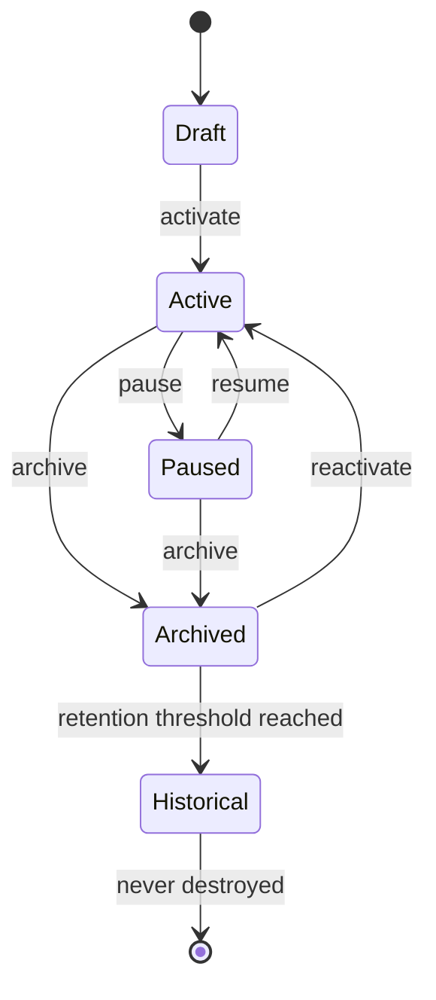

# §10 The Desk

◀ [[S09 What is Plexi]] · [[Part II — Product Model|▲ Part II]] · [[S11 Objects]] ▶

---

### 10.1 Definition

The **Desk** is the fundamental unit of work within Plexi. Everything exists inside a Desk.

A Desk represents a living workspace rather than a folder. It is persistent. It remembers. It evolves. Users never "open a project" — users return to a Desk.

Unlike a folder, a Desk has behaviour. Unlike a document, a Desk has memory. Unlike a dashboard, a Desk has intelligence.

### 10.2 Composition

Every Desk contains visual layout, Objects, Relationships, users, permissions, history, AI memory, Decisions, Events, workflows, active Agents and contextual state.

### 10.3 Desk archetypes

| Archetype | Represents | Examples |
|---|---|---|
| **Personal Desk** | A persistent workspace belonging to one individual | Daily Work, Personal Knowledge, Career, Research, Learning |
| **Project Desk** | A defined body of work | Product Launch, Website Redesign, Client Implementation |
| **Team Desk** | Ongoing operational work | Marketing, Finance, Engineering |
| **Organisation Desk** | An entire business unit, providing organisational visibility while respecting permissions | — |
| **Client Desk** | Every Object relating to a customer | CRM widgets, meetings, contracts, proposals, development, invoices, communications, AI agents |
| **Knowledge Desk** | A long-term knowledge repository that remains connected to active work | — |

Archetypes are **presentation and default-policy templates**, not distinct types. They share one schema ([[S33 Desk Entity|§33]]) and one permission model. A Desk's archetype may change without data migration.

### 10.4 Desk lifecycle

Historical Desks remain searchable forever, subject to the erasure carve-out in `[[REQ-SEC#PLX-SEC-030|PLX-SEC-030]]`.

### 10.5 Requirements

| ID | Requirement | V | Src |
|---|---|---|---|
| [[REQ-PRD#PLX-PRD-001|PLX-PRD-001]] | Every Object **MUST** belong to exactly one owning Desk. | T | §10, [[S44 Domain Invariants|§44]] R1 |
| [[REQ-PRD#PLX-PRD-002|PLX-PRD-002]] | A Desk **MUST** persist its complete visual layout, including Object positions, sizes, z-order, scroll positions, selections and zoom level, and **MUST** restore it on reopen. | T, D | §10.2, [[S21 Workspace Navigation|§21]] |
| [[REQ-PRD#PLX-PRD-003|PLX-PRD-003]] | Desk archetype **MUST** be a mutable attribute. Changing archetype **MUST NOT** require data migration, **MUST NOT** alter Object ownership, and **MUST** emit a `DeskArchetypeChanged` Event. | T | §10.3, new |
| [[REQ-PRD#PLX-PRD-004|PLX-PRD-004]] | Desk state transitions **MUST** follow the state machine in §10.4. Invalid transitions **MUST** be rejected with a machine-readable error identifying the attempted and permitted transitions. | T | §10.4 |
| [[REQ-PRD#PLX-PRD-005|PLX-PRD-005]] | Archiving or moving a Desk to Historical **MUST NOT** delete Events, Relationships or Decisions, and **MUST NOT** remove the Desk from search for users holding read permission. | T | §10.4, [[S44 Domain Invariants|§44]] R5 |
| [[REQ-PRD#PLX-PRD-006|PLX-PRD-006]] | A Desk **MUST** carry an explicit, user-editable **Current Objective**. Where absent, the platform **MUST** prompt for one and **MAY** propose a draft derived from Desk activity; a proposed objective **MUST** be marked as unconfirmed until a user accepts it. | T, D | [[S19 Cognitive Design Principles|§19]], [[S33 Desk Entity|§33]] |

---

---

## Requirements defined or cited here

- [[REQ-PRD#PLX-PRD-001|PLX-PRD-001]] — Every Object **MUST** belong to exactly one owning Desk.
- [[REQ-PRD#PLX-PRD-002|PLX-PRD-002]] — A Desk **MUST** persist its complete visual layout, including Object positions, sizes, z-order, scroll positio
- [[REQ-PRD#PLX-PRD-003|PLX-PRD-003]] — Desk archetype **MUST** be a mutable attribute. Changing archetype **MUST NOT** require data migration, **MUST
- [[REQ-PRD#PLX-PRD-004|PLX-PRD-004]] — Desk state transitions **MUST** follow the state machine in §10.4. Invalid transitions **MUST** be rejected wi
- [[REQ-PRD#PLX-PRD-005|PLX-PRD-005]] — Archiving or moving a Desk to Historical **MUST NOT** delete Events, Relationships or Decisions, and **MUST NO
- [[REQ-PRD#PLX-PRD-006|PLX-PRD-006]] — A Desk **MUST** carry an explicit, user-editable **Current Objective**. Where absent, the platform **MUST** pr
- [[REQ-SEC#PLX-SEC-030|PLX-SEC-030]] — The platform **MUST** implement cryptographic erasure for personal data: per-subject key material, destroyed o

◀ [[S09 What is Plexi]] · [[Part II — Product Model|▲ Part II]] · [[S11 Objects]] ▶
