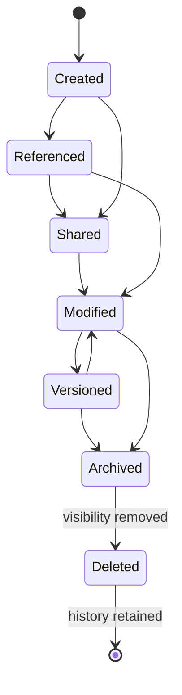

# §11 Objects

◀ [[S10 The Desk]] · [[Part II — Product Model|▲ Part II]] · [[S12 Context]] ▶

---

### 11.1 Definition

Everything visible inside Plexi is an **Object**. Objects are first-class entities. The platform never privileges documents over conversations, or widgets over AI. Every Object shares the same underlying architecture.

### 11.2 Core properties

Every Object carries: unique identifier, owner, workspace, creation date, version, permission model, Relationships, Context Health, Event history, AI metadata, lifecycle state, tags and semantic embeddings. The normative schema is §34.

### 11.3 Initial Object types

Document · Spreadsheet · Presentation · Widget · Database Table · Kanban · Whiteboard · Code Editor · Terminal · Chat · Meeting · Voice Recording · Video · Email · Decision · Task · Automation · Workflow · AI Conversation · Prompt · Agent · Timeline · Diagram · Canvas · Knowledge Card · Bookmark · Browser Window · Dashboard · API Connection · External Application

### 11.4 Object lifecycle

**Deletion never removes history.** Deletion removes visibility. History remains immutable. The single carve-out is lawful erasure under `[[REQ-SEC#PLX-SEC-030|PLX-SEC-030]]`, which is executed by cryptographic destruction rather than record removal — see §69.7 and `[[Risk Register#PLX-RSK-01|PLX-RSK-01]]`.

### 11.5 Requirements

| ID | Requirement | V | Src |
|---|---|---|---|
| [[REQ-PRD#PLX-PRD-010|PLX-PRD-010]] | All Object types **MUST** use the universal Object schema ([[S34 Object Entity|§34]]). Type-specific data **MUST** be carried in the typed payload, not by extending the base schema. | I, T | §11, [[S34 Object Entity|§34]] |
| [[REQ-PRD#PLX-PRD-011|PLX-PRD-011]] | The Object type registry **MUST** be extensible at runtime without redeployment of the Object Service, and extension-registered types **MUST** receive identical permission, event, versioning and Context Health handling to built-in types. | T | §11.3, [[S83 Marketplace Architecture|§83]] |
| [[REQ-PRD#PLX-PRD-012|PLX-PRD-012]] | Deletion of an Object **MUST** remove it from default visibility and search results while retaining its Events, Relationships and version history. | T | §11.4, [[S44 Domain Invariants|§44]] R5 |
| [[REQ-PRD#PLX-PRD-013|PLX-PRD-013]] | The platform **MUST** present users with an accurate, plain-language statement of what deletion does and does not remove, at the point of deletion. | D, I | §11.4, new |
| [[REQ-PRD#PLX-PRD-014|PLX-PRD-014]] | Every Object **MUST** carry semantic embeddings maintained within `[[REQ-PERF#PLX-PERF-020|PLX-PERF-020]]` of a content-changing Event, or be explicitly excluded from semantic indexing by policy with the exclusion recorded. | T, A | §11.2, [[S54 Search Architecture|§54]] |

> **On `[[REQ-PRD#PLX-PRD-013|PLX-PRD-013]]`.** "Deletion never removes history" is correct engineering and, presented without explanation, is a trust incident waiting to happen. A user who deletes a document containing a salary figure and later learns the Event history retained the before-and-after values will not accept "but the invariant is documented in [[S44 Domain Invariants|§44]]". The invariant is right; hiding it is not.

---

---

## Requirements defined or cited here

- [[REQ-PERF#PLX-PERF-020|PLX-PERF-020]] — Context Health update — direct impact (depth 0–1) — p50 60 ms, p95 180 ms, p99 **250 ms**. Measured: Event ing
- [[REQ-PRD#PLX-PRD-010|PLX-PRD-010]] — All Object types **MUST** use the universal Object schema (§34). Type-specific data **MUST** be carried in the
- [[REQ-PRD#PLX-PRD-011|PLX-PRD-011]] — The Object type registry **MUST** be extensible at runtime without redeployment of the Object Service, and ext
- [[REQ-PRD#PLX-PRD-012|PLX-PRD-012]] — Deletion of an Object **MUST** remove it from default visibility and search results while retaining its Events
- [[REQ-PRD#PLX-PRD-013|PLX-PRD-013]] — The platform **MUST** present users with an accurate, plain-language statement of what deletion does and does
- [[REQ-PRD#PLX-PRD-014|PLX-PRD-014]] — Every Object **MUST** carry semantic embeddings maintained within `PLX-PERF-020` of a content-changing Event,
- [[REQ-SEC#PLX-SEC-030|PLX-SEC-030]] — The platform **MUST** implement cryptographic erasure for personal data: per-subject key material, destroyed o

◀ [[S10 The Desk]] · [[Part II — Product Model|▲ Part II]] · [[S12 Context]] ▶
