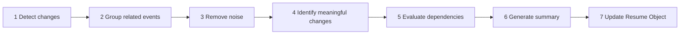

# §14 Resume Intelligence

◀ [[S13 Workspace Memory]] · [[Part II — Product Model|▲ Part II]] · [[S15 Knowledge Graph]] ▶

---

### 14.1 Purpose

Resume Intelligence eliminates restart friction. Whenever a user returns, Plexi reconstructs understanding.

### 14.2 Resume panel

Every Desk displays a persistent Resume Summary:

> **Current Goal** — Complete pricing proposal.
>
> **Progress Since Last Visit** — Finance approved budget. Marketing added revised messaging. Legal requested one amendment.
>
> **Decisions Made** — Pricing approved. Launch delayed one week.
>
> **Outstanding Decisions** — Legal approval.
>
> **Suggested Next Action** — Review Clause 14 before sending proposal.
>
> **Estimated Catch-up Time** — 2 minutes.

### 14.3 Generation pipeline

The Resume Object is a first-class entity ([[S39 Resume Entity|§39]]).

### 14.4 Requirements

| ID | Requirement | V | Src |
|---|---|---|---|
| [[REQ-PRD#PLX-PRD-040|PLX-PRD-040]] | Resume generation **MUST** be continuous and automatic. The platform **MUST NOT** require a user to request a Resume. | T, D | §14, [[S52 Resume Engine|§52]] |
| [[REQ-PRD#PLX-PRD-041|PLX-PRD-041]] | Every Resume assertion **MUST** carry references to the Events that support it. | T | §14, §7.9 |
| [[REQ-PRD#PLX-PRD-042|PLX-PRD-042]] | Resume Objects **MUST** be versioned and comparable, so that a user can diff the current understanding against any prior Resume for the same Desk. | T, D | [[S39 Resume Entity|§39]] |
| [[REQ-PRD#PLX-PRD-043|PLX-PRD-043]] | Estimated catch-up time **MUST** be presented with an accuracy qualifier, and its calibration **MUST** be tracked as `[[REQ-MET#PLX-MET-003|PLX-MET-003]]`. | T, A | §14.2, new |
| [[REQ-PRD#PLX-PRD-044|PLX-PRD-044]] | Where the Resume Engine has insufficient signal to produce a confident summary, it **MUST** state that plainly rather than emitting a low-confidence narrative. | T, D | §14, §7.10 |

> **On `[[REQ-PRD#PLX-PRD-043|PLX-PRD-043]]` and `[[REQ-PRD#PLX-PRD-044|PLX-PRD-044]]`.** "Estimated Catch-up Time: 2 minutes" is a precise-looking number. If it is routinely wrong, users stop reading the Resume panel entirely, and the panel is the product's front door. A wrong number is worse than no number; an honest range beats a confident point estimate. Likewise a Resume that says "not much happened, and I'm not certain I've caught everything" earns more trust over a year than one that always produces four confident bullets.

---

---

## Requirements defined or cited here

- [[REQ-MET#PLX-MET-003|PLX-MET-003]] — Catch-up estimate calibration — Absolute error between estimated catch-up time and observed reconstruction tim
- [[REQ-PRD#PLX-PRD-040|PLX-PRD-040]] — Resume generation **MUST** be continuous and automatic. The platform **MUST NOT** require a user to request a
- [[REQ-PRD#PLX-PRD-041|PLX-PRD-041]] — Every Resume assertion **MUST** carry references to the Events that support it.
- [[REQ-PRD#PLX-PRD-042|PLX-PRD-042]] — Resume Objects **MUST** be versioned and comparable, so that a user can diff the current understanding against
- [[REQ-PRD#PLX-PRD-043|PLX-PRD-043]] — Estimated catch-up time **MUST** be presented with an accuracy qualifier, and its calibration **MUST** be trac
- [[REQ-PRD#PLX-PRD-044|PLX-PRD-044]] — Where the Resume Engine has insufficient signal to produce a confident summary, it **MUST** state that plainly

◀ [[S13 Workspace Memory]] · [[Part II — Product Model|▲ Part II]] · [[S15 Knowledge Graph]] ▶
