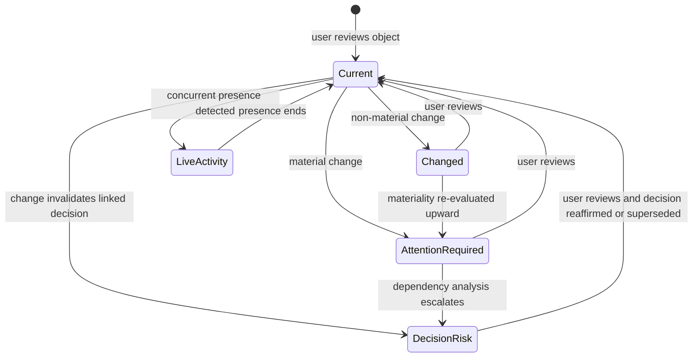
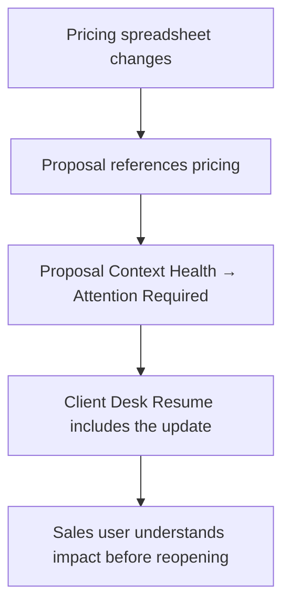

# §20 Context Health

◀ [[S19 Cognitive Design Principles]] · [[Part III — User Experience|▲ Part III]] · [[S21 Workspace Navigation]] ▶

---

### 20.1 Definition

Every Object possesses a **Context Health** state. Context Health measures how current *the user's understanding* is relative to the current state of the Object.

This is fundamentally different from Object status. A document may be complete while a user's understanding of that document is outdated.

**Context Health is therefore per-user, per-Object.** It is not a property of the Object alone. This has significant storage and computation consequences and is registered as `[[Risk Register#PLX-RSK-03|PLX-RSK-03]]`.

### 20.2 Purpose

Context Health replaces excessive notifications with ambient awareness. Instead of interrupting users, Plexi quietly communicates the freshness of their understanding.

### 20.3 States

| State | Meaning | Interface behaviour |
|---|---|---|
| **Current** | The user has reviewed the latest meaningful information | No action required; no indicator emphasis |
| **Changed** | The Object has changed since the user's previous review; changes are not believed to affect active decisions | Visual indication only |
| **Attention Required** | Changes may affect current work | Resume Card highlights the Object; AI explains why the change matters |
| **Decision Risk** | One or more Decisions associated with this Object may no longer be valid | Surfaced immediately in Resume Intelligence; evidence displayed before recommendation |
| **Live Activity** | Another user is actively interacting with the Object | Subtle presence; no interruption unless collaboration requires attention |

### 20.4 State machine

`Live Activity` is an **overlay**, not an exclusive state: an Object may simultaneously be `Attention Required` and have live presence. Implementations **MUST** model presence as an orthogonal dimension.

### 20.5 Propagation

Context Health propagates through Relationships.

### 20.6 Requirements

| ID | Requirement | V | Src |
|---|---|---|---|
| [[REQ-UX#PLX-UX-020|PLX-UX-020]] | Context Health **MUST** be evaluated per (user, Object) pair, relative to that user's last review point. | T | §20.1 |
| [[REQ-UX#PLX-UX-021|PLX-UX-021]] | Context Health transitions **MUST** be driven by materiality score ([[S80 Context Engine Algorithms|§80]]), not by raw change detection. A non-material change **MUST NOT** produce an `Attention Required` transition. | T | §20, [[S51 Context Engine|§51]] |
| [[REQ-UX#PLX-UX-022|PLX-UX-022]] | Context Health **MUST** propagate across confirmed Relationships. Propagation depth **MUST** be bounded by configuration, and the bound **MUST** be recorded in the propagation Event so that truncation is visible rather than silent. | T, A | §20.5, [[S80 Context Engine Algorithms|§80]] |
| [[REQ-UX#PLX-UX-023|PLX-UX-023]] | Presence (`Live Activity`) **MUST** be modelled orthogonally to Context Health state and **MUST NOT** overwrite an `Attention Required` or `Decision Risk` state. | T | §20.3, new |
| [[REQ-UX#PLX-UX-024|PLX-UX-024]] | Every Context Health transition **MUST** record the triggering Event, the materiality score, and the propagation path, and this record **MUST** be retrievable by the user (`[[REQ-UX#PLX-UX-015|PLX-UX-015]]`). | T | §20, [[S07 Design Principles|§7]] |
| [[REQ-UX#PLX-UX-025|PLX-UX-025]] | Transition to `Decision Risk` **MUST** identify the specific Decision or Decisions at risk and the specific change believed to invalidate them. A `Decision Risk` state without a named Decision **MUST NOT** be raised. | T | §20.3, [[S37 Decision Entity|§37]] |

---

---

## Requirements defined or cited here

- [[REQ-UX#PLX-UX-015|PLX-UX-015]] — Every recommendation, Context Health transition and Resume assertion **MUST** expose its evidence within one i
- [[REQ-UX#PLX-UX-020|PLX-UX-020]] — Context Health **MUST** be evaluated per (user, Object) pair, relative to that user's last review point.
- [[REQ-UX#PLX-UX-021|PLX-UX-021]] — Context Health transitions **MUST** be driven by materiality score (§80), not by raw change detection. A non-m
- [[REQ-UX#PLX-UX-022|PLX-UX-022]] — Context Health **MUST** propagate across confirmed Relationships. Propagation depth **MUST** be bounded by con
- [[REQ-UX#PLX-UX-023|PLX-UX-023]] — Presence (`Live Activity`) **MUST** be modelled orthogonally to Context Health state and **MUST NOT** overwrit
- [[REQ-UX#PLX-UX-024|PLX-UX-024]] — Every Context Health transition **MUST** record the triggering Event, the materiality score, and the propagati
- [[REQ-UX#PLX-UX-025|PLX-UX-025]] — Transition to `Decision Risk` **MUST** identify the specific Decision or Decisions at risk and the specific ch

◀ [[S19 Cognitive Design Principles]] · [[Part III — User Experience|▲ Part III]] · [[S21 Workspace Navigation]] ▶
