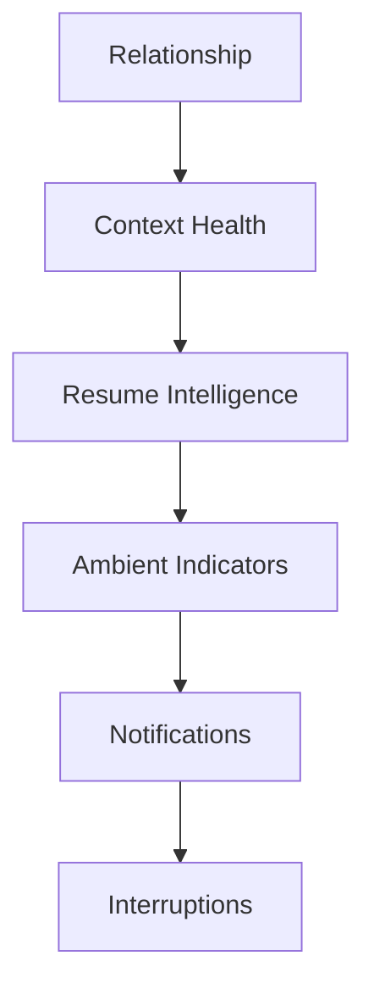

# §26 Notifications

◀ [[S25 Collaboration]] · [[Part III — User Experience|▲ Part III]] · [[S27 Accessibility]] ▶

---

Notifications are the final layer of communication. The preferred hierarchy is:

### 26.1 Notification categories

Information · Awareness · Recommendation · Approval Required · Critical Decision · Security · System

Only decisions with meaningful impact should interrupt users.

### 26.2 Reconciling the philosophy with the taxonomy

[[S06 Product Philosophy|§6]] Philosophy 7 states *"notifications are failures."* §26.1 then defines seven notification categories. Both are correct, but as written they conflict, and an implementer given both will resolve the conflict by shipping notifications.

The reconciliation is an explicit **escalation ladder**: a signal enters at the lowest layer capable of carrying it, and escalates only on defined triggers.

| Layer | Escalation trigger to next layer |
|---|---|
| Relationship | — (never escalates on its own) |
| Context Health | Materiality exceeds the attention threshold |
| Resume Intelligence | Change affects a Decision or a dependency owned by the user |
| Ambient Indicator | Time-sensitive with a deadline inside the user's working horizon |
| Notification | Requires user action to unblock another party, or a security event |
| Interruption | Security incident, or an approval whose deadline expires within the interruption window |

| ID | Requirement | V | Src |
|---|---|---|---|
| [[REQ-UX#PLX-UX-042|PLX-UX-042]] | Interruptive notification volume per active user **MUST** be instrumented and reported per release as a regression metric. | A | §6.7, §26, new |
| [[REQ-UX#PLX-UX-043|PLX-UX-043]] | Every notification emitted **MUST** record the escalation layer it entered at and the trigger that escalated it. Notifications emitted without a recorded escalation trigger **MUST** be treated as defects. | T, I | §26.2, new |
| [[REQ-UX#PLX-UX-044|PLX-UX-044]] | The `Security` category **MUST** be exempt from user-configurable suppression. All other categories **MUST** be user-suppressible. | T | §26.1, new |
| [[REQ-UX#PLX-UX-045|PLX-UX-045]] | A user **MUST** be able to view, in one place, every signal the platform chose *not* to escalate to them in a given period, so that suppression remains inspectable rather than opaque. | D | §26, new |

> **On `[[REQ-UX#PLX-UX-045|PLX-UX-045]]`.** A calm system is only trustworthy if you can audit its silence. Users who suspect the system is hiding things from them will compensate by checking manually, which reintroduces exactly the cognitive load the product exists to remove.

---

---

## Requirements defined or cited here

- [[REQ-UX#PLX-UX-042|PLX-UX-042]] — Interruptive notification volume per active user **MUST** be instrumented and reported per release as a regres
- [[REQ-UX#PLX-UX-043|PLX-UX-043]] — Every notification emitted **MUST** record the escalation layer it entered at and the trigger that escalated i
- [[REQ-UX#PLX-UX-044|PLX-UX-044]] — The `Security` category **MUST** be exempt from user-configurable suppression. All other categories **MUST** b
- [[REQ-UX#PLX-UX-045|PLX-UX-045]] — A user **MUST** be able to view, in one place, every signal the platform chose *not* to escalate to them in a

◀ [[S25 Collaboration]] · [[Part III — User Experience|▲ Part III]] · [[S27 Accessibility]] ▶
