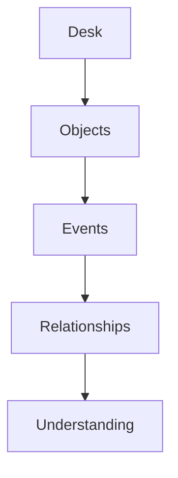

# §31 Core Philosophy

◀ [[S30 Domain Model]] · [[Part IV — Domain Model|▲ Part IV]] · [[S32 Canonical Entity Model]] ▶

---

The platform is built upon five layered concepts:

Everything else is derived. Nothing bypasses these layers.

---

---

◀ [[S30 Domain Model]] · [[Part IV — Domain Model|▲ Part IV]] · [[S32 Canonical Entity Model]] ▶
