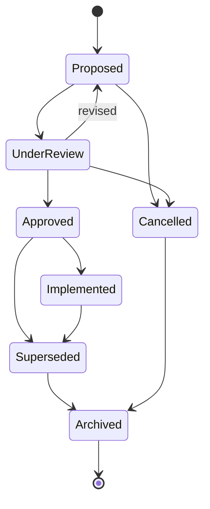

# §37 Decision Entity

◀ [[S36 Relationship Entity]] · [[Part IV — Domain Model|▲ Part IV]] · [[S38 Context Entity]] ▶

---

### 37.1 Why Decisions matter

Documents explain work. **Decisions explain organisations.** Plexi treats Decisions as permanent first-class Objects.

### 37.2 Schema

```typescript
interface Decision extends BaseEntity {
  entityType:        "decision";

  title:             string;
  description:       string;
  decisionStatement: string;            // what was actually decided

  decisionOwner:     ActorRef;          // MUST be a human — PLX-DOM-040
  decisionDate:      Timestamp | null;
  state:             "proposed" | "under_review" | "approved" | "implemented"
                     | "superseded" | "cancelled" | "archived";

  confidence:        ConfidenceBand | null;
  evidence:          EvidenceRef[];
  alternatives:      Alternative[];
  risks:             RiskNote[];

  relatedObjectIds:  UUID[];
  affectedDeskIds:   UUID[];
  dependencyIds:     UUID[];
  approvals:         Approval[];

  aiCommentary:      AiCommentary[];    // advisory only — never authoritative
  supersededById:    UUID | null;
  history:           StreamRef;
}

interface Alternative {
  statement:   string;
  rejectedFor: string;
  evidence:    EvidenceRef[];
}

interface Approval {
  approver:    ActorRef;     // MUST be a human principal
  state:       "pending" | "granted" | "declined";
  at:          Timestamp | null;
  rationale:   string | null;
}
```

### 37.3 Decision state machine



### 37.4 AI responsibilities

AI **may** identify missing evidence, identify conflicting assumptions, identify affected work, summarise discussion, and recommend review.

**AI never owns decisions. Humans remain accountable.**

| ID | Requirement | V | Src |
|---|---|---|---|
| [[REQ-DOM#PLX-DOM-040|PLX-DOM-040]] | `decisionOwner` and every `Approval.approver` **MUST** be a human principal. An Agent or service principal **MUST NOT** be recorded as a Decision owner or approver. | T | §37.4, §7.7 |
| [[REQ-DOM#PLX-DOM-041|PLX-DOM-041]] | `aiCommentary` **MUST** be stored and displayed as advisory. It **MUST NOT** be rendered in a manner that implies it constitutes the Decision, the rationale of record, or an approval. | T, D | §37.4 |
| [[REQ-DOM#PLX-DOM-042|PLX-DOM-042]] | Superseding a Decision **MUST** set `supersededById`, **MUST** create a `DecisionSuperseded` Event, and **MUST** trigger Context Health re-evaluation for every Object referencing the superseded Decision. | T | §37, [[S20 Context Health|§20]] |
| [[REQ-DOM#PLX-DOM-043|PLX-DOM-043]] | Rejected `alternatives` **MUST** be retained permanently. The record of what was *not* chosen, and why, **MUST NOT** be pruned by any retention or compression process. | T, I | §37.2, new |

> **On `[[REQ-DOM#PLX-DOM-043|PLX-DOM-043]]`.** This is the single highest-value data in the entire platform and the easiest to lose. "Why didn't we do X?" is the question that costs organisations the most to re-answer, and the alternatives array is the only place the answer lives. It must be explicitly exempted from compression and retention pruning, or it will be swept away by a well-meaning storage optimisation in year three.

---

---

## Requirements defined or cited here

- [[REQ-DOM#PLX-DOM-040|PLX-DOM-040]] — `decisionOwner` and every `Approval.approver` **MUST** be a human principal. An Agent or service principal **M
- [[REQ-DOM#PLX-DOM-041|PLX-DOM-041]] — `aiCommentary` **MUST** be stored and displayed as advisory. It **MUST NOT** be rendered in a manner that impl
- [[REQ-DOM#PLX-DOM-042|PLX-DOM-042]] — Superseding a Decision **MUST** set `supersededById`, **MUST** create a `DecisionSuperseded` Event, and **MUST
- [[REQ-DOM#PLX-DOM-043|PLX-DOM-043]] — Rejected `alternatives` **MUST** be retained permanently. The record of what was *not* chosen, and why, **MUST

◀ [[S36 Relationship Entity]] · [[Part IV — Domain Model|▲ Part IV]] · [[S38 Context Entity]] ▶
