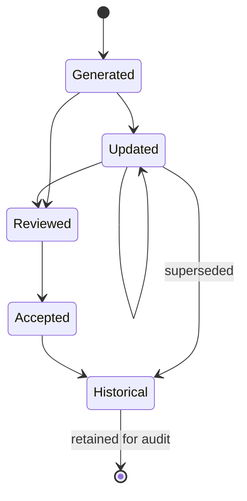

# §38 Context Entity

◀ [[S37 Decision Entity]] · [[Part IV — Domain Model|▲ Part IV]] · [[S39 Resume Entity]] ▶

---

Context itself becomes a managed Object. This is one of Plexi's primary innovations.

### 38.1 Schema

```typescript
interface Context extends BaseEntity {
  entityType:          "context";

  deskId:              UUID;
  currentGoal:         Objective | null;
  currentQuestion:     CognitiveField | null;
  recentActivity:      ActivityRef[];
  recentDecisionIds:   UUID[];
  pendingWorkIds:      UUID[];
  dependencyIds:       UUID[];
  attentionItems:      AttentionItem[];

  riskLevel:           "none" | "low" | "medium" | "high";
  suggestedNextAction: Recommendation | null;
  estimatedResumeTime: Duration | null;
  confidence:          ConfidenceBand | null;

  generatedAt:         Timestamp;
  reviewedAt:          Timestamp | null;
  reviewedBy:          ActorRef | null;
}

interface CognitiveField {
  value:      string;
  source:     "declared" | "inferred";   // PLX-PRD-020
  confidence: ConfidenceBand | null;     // REQUIRED when inferred
  evidence:   EvidenceRef[];             // REQUIRED when inferred
}
```

### 38.2 Lifecycle



Every historical Context Object remains available for audit and organisational learning.

| ID | Requirement | V | Src |
|---|---|---|---|
| [[REQ-CTX#PLX-CTX-001|PLX-CTX-001]] | Context Objects **MUST** be versioned and retained. Superseded Context Objects **MUST** remain retrievable for audit. | T | §38.2 |
| [[REQ-CTX#PLX-CTX-002|PLX-CTX-002]] | Every field in a Context Object derived from inference **MUST** carry source, confidence and evidence (`CognitiveField`). | T | §38, [[S12 Context|§12]] |

---

---

## Requirements defined or cited here

- [[REQ-CTX#PLX-CTX-001|PLX-CTX-001]] — Context Objects **MUST** be versioned and retained. Superseded Context Objects **MUST** remain retrievable for
- [[REQ-CTX#PLX-CTX-002|PLX-CTX-002]] — Every field in a Context Object derived from inference **MUST** carry source, confidence and evidence (`Cognit
- [[REQ-PRD#PLX-PRD-020|PLX-PRD-020]] — Cognitive Context values **MUST** be labelled with their acquisition method: `declared` (user-stated), `inferr

◀ [[S37 Decision Entity]] · [[Part IV — Domain Model|▲ Part IV]] · [[S39 Resume Entity]] ▶
