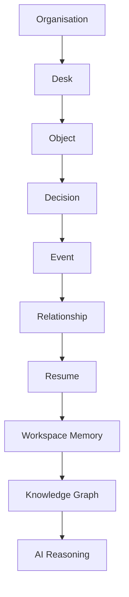

# §43 Entity Relationships

◀ [[S42 Organisation Entity]] · [[Part IV — Domain Model|▲ Part IV]] · [[S44 Domain Invariants]] ▶

---

Conceptually, entities layer as follows:

This hierarchy is **conceptual only**. Internally, all entities participate equally within the graph. Implementations **MUST NOT** encode this diagram as a storage or traversal hierarchy.

---

---

◀ [[S42 Organisation Entity]] · [[Part IV — Domain Model|▲ Part IV]] · [[S44 Domain Invariants]] ▶
