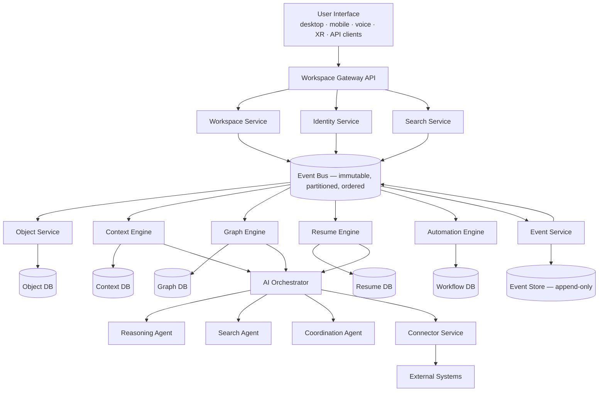

# §46 High-Level System Architecture

◀ [[S45 Platform Architecture]] · [[Part V — Platform Architecture|▲ Part V]] · [[S47 Service Architecture]] ▶

---

### 46.1 Responsibility boundaries

Each service owns exactly one business capability. No service directly manipulates another service's data. Communication occurs exclusively through APIs and Events. This prevents tight coupling.

### 46.2 Correction to the source diagram

The v1.0 Part V diagram showed the AI Orchestrator downstream of the derived-state services and the Connector Service downstream of the AI Orchestrator. As drawn, this implies connectors are reachable only through AI, which contradicts [[S57 Connector Framework|§57]] (connectors expose capabilities to the platform, not only to agents) and would make deterministic integration sync impossible.

The corrected topology above places the Connector Service as a peer service reachable both by the AI Orchestrator (as a tool surface) and directly by the Event Bus (for deterministic synchronisation). This is a **defect correction**, recorded in Appendix H.

---

---

◀ [[S45 Platform Architecture]] · [[Part V — Platform Architecture|▲ Part V]] · [[S47 Service Architecture]] ▶
