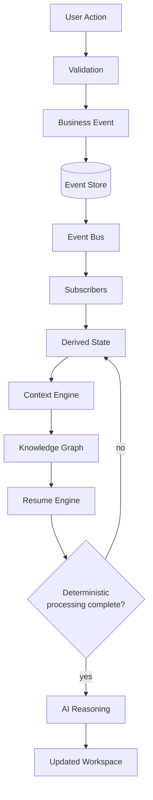
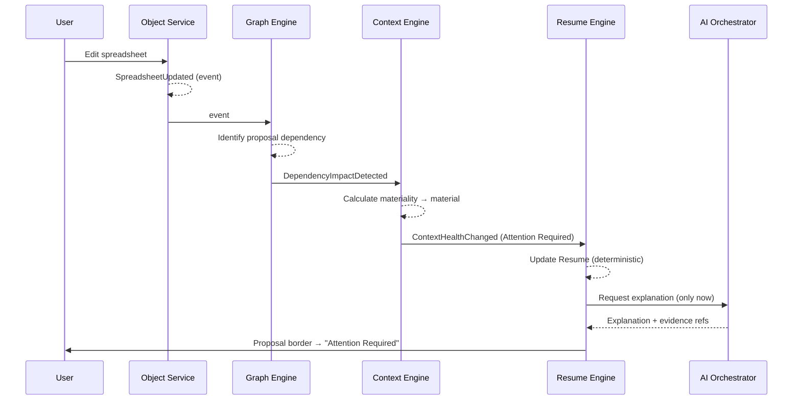

# §48 Event Architecture

◀ [[S47 Service Architecture]] · [[Part V — Platform Architecture|▲ Part V]] · [[S49 Event Store]] ▶

---

Events are the heartbeat of Plexi. Everything meaningful becomes an Event.

### 48.1 Event flow

**Events never invoke AI directly.** Deterministic processing always executes first. AI reasoning occurs only after deterministic processing completes.

### 48.2 Event categories

User Events · System Events · Workflow Events · AI Events · Integration Events · Security Events · Administrative Events · Lifecycle Events

### 48.3 Worked example

Note the ordering: the Context Health transition and the Resume update are complete **before** AI is consulted. The AI call adds explanation to a conclusion the deterministic layer already reached. If the AI call fails, the user still sees the correct state — just without prose.

### 48.4 Requirements

| ID | Requirement | V | Src |
|---|---|---|---|
| [[REQ-EVT#PLX-EVT-020|PLX-EVT-020]] | Deterministic processing of an Event **MUST** complete before any AI reasoning is invoked on that Event. AI invocation **MUST NOT** be a precondition for any Context Health transition, Relationship confirmation or Resume update. | T, A | §48 |
| [[REQ-EVT#PLX-EVT-021|PLX-EVT-021]] | Failure or unavailability of AI reasoning **MUST NOT** prevent Event processing, Context Health computation or Resume generation from completing. | T | §48, [[S45 Platform Architecture|§45]] |
| [[REQ-EVT#PLX-EVT-022|PLX-EVT-022]] | The Event Bus **MUST** preserve ordering within a partition. The partition key **MUST** be `deskId` for Desk-scoped Events and `objectId` for Object-scoped Events, so that causally related Events are never reordered relative to one another. | T, A | §48, new |
| [[REQ-EVT#PLX-EVT-023|PLX-EVT-023]] | Every Event **MUST** be assigned to exactly one of the categories in §48.2, and the category **MUST** be carried on the wire. | T | §48.2, new |
| [[REQ-EVT#PLX-EVT-024|PLX-EVT-024]] | Consumers **MUST** handle out-of-order delivery across partitions and **MUST NOT** assume global total ordering. | T | §48, new |

> **On `[[REQ-EVT#PLX-EVT-022|PLX-EVT-022]]` — the partition key decision.** This is the single most consequential undocumented choice in the source architecture. Ordering is only guaranteed within a partition. If Events are partitioned by `objectId`, two edits to different Objects on the same Desk can be processed out of order, and a Resume can be generated from a partially-applied view of the Desk. If partitioned by `deskId`, ordering within a Desk is safe but a single very active Desk becomes a throughput hot spot that cannot be scaled horizontally. The hybrid stated above is the workable compromise, and it needs load modelling before Phase 1 — a large Organisation Desk with thousands of Objects is exactly the shape that breaks it. Tracked as `[[Risk Register#PLX-RSK-08|PLX-RSK-08]]`.

---

---

## Requirements defined or cited here

- [[REQ-EVT#PLX-EVT-020|PLX-EVT-020]] — Deterministic processing of an Event **MUST** complete before any AI reasoning is invoked on that Event. AI in
- [[REQ-EVT#PLX-EVT-021|PLX-EVT-021]] — Failure or unavailability of AI reasoning **MUST NOT** prevent Event processing, Context Health computation or
- [[REQ-EVT#PLX-EVT-022|PLX-EVT-022]] — The Event Bus **MUST** preserve ordering within a partition. The partition key **MUST** be `deskId` for Desk-s
- [[REQ-EVT#PLX-EVT-023|PLX-EVT-023]] — Every Event **MUST** be assigned to exactly one of the categories in §48.2, and the category **MUST** be carri
- [[REQ-EVT#PLX-EVT-024|PLX-EVT-024]] — Consumers **MUST** handle out-of-order delivery across partitions and **MUST NOT** assume global total orderin

◀ [[S47 Service Architecture]] · [[Part V — Platform Architecture|▲ Part V]] · [[S49 Event Store]] ▶
