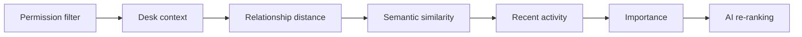

# §54 Search Architecture

◀ [[S53 Knowledge Graph Runtime]] · [[Part V — Platform Architecture|▲ Part V]] · [[S55 AI Orchestration]] ▶

---

Search combines keyword, semantic, relationship, context, time, permission and intent signals.

### 54.1 Ranking pipeline

| ID | Requirement | V | Src |
|---|---|---|---|
| [[REQ-SCH#PLX-SCH-001|PLX-SCH-001]] | Permission filtering **MUST** be the first stage of the ranking pipeline and **MUST** be applied at the index or query layer, not as a post-filter over returned results. | T, A | §54 |
| [[REQ-SCH#PLX-SCH-002|PLX-SCH-002]] | Result counts, pagination totals and relevance scores **MUST NOT** disclose the existence of non-permitted results. | T | §54, new |
| [[REQ-SCH#PLX-SCH-003|PLX-SCH-003]] | AI re-ranking **MUST** be the final stage and **MUST** be optional. Disabling it **MUST** degrade result ordering, not result correctness or completeness. | T | §54, [[S48 Event Architecture|§48]] |
| [[REQ-SCH#PLX-SCH-004|PLX-SCH-004]] | Search **MUST** meet `[[REQ-PERF#PLX-PERF-040|PLX-PERF-040]]` with AI re-ranking disabled. AI re-ranking **MUST** operate within a separate, additive budget and **MUST** be abandoned rather than exceed it. | A | [[S58 Performance Requirements|§58]], new |
| [[REQ-SCH#PLX-SCH-005|PLX-SCH-005]] | Semantic index freshness **MUST** meet `[[REQ-PERF#PLX-PERF-041|PLX-PERF-041]]`; where an Object's embedding is stale, results **MUST** still include the Object via keyword and relationship paths. | T, A | §54, new |

---

---

## Requirements defined or cited here

- [[REQ-PERF#PLX-PERF-040|PLX-PERF-040]] — Search, AI re-ranking disabled — p50 80 ms, p95 200 ms, p99 **300 ms**. Measured: Query ingress → ranked resul
- [[REQ-PERF#PLX-PERF-041|PLX-PERF-041]] — Semantic index freshness after content-changing Event — p50 2 s, p95 10 s, p99 30 s. Measured: Event → embeddi
- [[REQ-SCH#PLX-SCH-001|PLX-SCH-001]] — Permission filtering **MUST** be the first stage of the ranking pipeline and **MUST** be applied at the index
- [[REQ-SCH#PLX-SCH-002|PLX-SCH-002]] — Result counts, pagination totals and relevance scores **MUST NOT** disclose the existence of non-permitted res
- [[REQ-SCH#PLX-SCH-003|PLX-SCH-003]] — AI re-ranking **MUST** be the final stage and **MUST** be optional. Disabling it **MUST** degrade result order
- [[REQ-SCH#PLX-SCH-004|PLX-SCH-004]] — Search **MUST** meet `PLX-PERF-040` with AI re-ranking disabled. AI re-ranking **MUST** operate within a separ
- [[REQ-SCH#PLX-SCH-005|PLX-SCH-005]] — Semantic index freshness **MUST** meet `PLX-PERF-041`; where an Object's embedding is stale, results **MUST**

◀ [[S53 Knowledge Graph Runtime]] · [[Part V — Platform Architecture|▲ Part V]] · [[S55 AI Orchestration]] ▶
