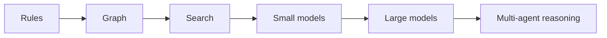

# §68 AI Cost Optimisation

◀ [[S67 AI Prompt Framework]] · [[Part VI — Data, APIs, Security & Engineering Standards|▲ Part VI]] · [[S69 Security Architecture]] ▶

---

Token usage is a first-class engineering metric.

### 68.1 Rules

Never invoke AI if deterministic logic can solve the problem. Reuse cached reasoning. Generate summaries incrementally. Store structured understanding rather than regenerated text. Compress historical conversations. Avoid duplicate embedding generation. Batch semantic updates. Use lightweight models for classification. Reserve premium models for reasoning.

### 68.2 Cost hierarchy

The platform always executes the least expensive mechanism capable of producing an acceptable answer.

### 68.3 Requirements

| ID | Requirement | V | Src |
|---|---|---|---|
| [[REQ-AI#PLX-AI-020|PLX-AI-020]] | Every AI invocation **MUST** record token counts, model identity and version, cost, latency and cache status (`[[REQ-AI#PLX-AI-007|PLX-AI-007]]`). | T | §68, [[S72 Observability|§72]] |
| [[REQ-AI#PLX-AI-021|PLX-AI-021]] | Reasoning outputs **MUST** be cached keyed by the digest of the structured input. Cache hit rate **MUST** be reported per prompt type. | T, A | §68, [[S72 Observability|§72]] |
| [[REQ-AI#PLX-AI-022|PLX-AI-022]] | Embeddings **MUST NOT** be regenerated for unchanged content. Embedding generation **MUST** be keyed by content digest and embedding model version. | T | §68 |
| [[REQ-AI#PLX-AI-030|PLX-AI-030]] | Every Organisation and every Desk **MUST** support a configurable AI cost ceiling. Exceeding a ceiling **MUST** suspend AI operations for that scope and emit `CostCeilingExceeded`, and **MUST NOT** silently substitute a cheaper model or truncate context. | T | §68, new |
| [[REQ-AI#PLX-AI-031|PLX-AI-031]] | The platform **MUST** report fully loaded AI cost per active user per tenant (`[[REQ-MET#PLX-MET-011|PLX-MET-011]]`) and **MUST** publish a unit-economics model before general availability. | A, I | §68, new |
| [[REQ-AI#PLX-AI-032|PLX-AI-032]] | Model selection **MUST** be recorded per invocation with the routing rationale, so that cost regressions are attributable. | T | §68, new |

> **On `[[REQ-AI#PLX-AI-030|PLX-AI-030]]` and `[[REQ-AI#PLX-AI-031|PLX-AI-031]]`.** Plexi's design commits to continuous AI observation over every Event, for every Desk, for every tenant, indefinitely. That is a fundamentally different cost shape from per-request AI products, and it is the most likely reason for the business model to fail quietly: gross margin erodes with usage rather than improving with scale, and the most engaged customers are the least profitable. The deterministic-first ordering of [[S48 Event Architecture|§48]] and the cost hierarchy of §68.2 are the primary defences and are well chosen. What is missing from the source is a hard ceiling and a published unit-economics model. A ceiling that silently degrades quality instead of stopping is worse than no ceiling — it converts a budget problem into a trust problem. Tracked as `[[Risk Register#PLX-RSK-05|PLX-RSK-05]]`.

---

---

## Requirements defined or cited here

- [[REQ-AI#PLX-AI-007|PLX-AI-007]] — Every model invocation **MUST** be recorded with model identity, version, token counts, cost, latency, cache s
- [[REQ-AI#PLX-AI-020|PLX-AI-020]] — Every AI invocation **MUST** record token counts, model identity and version, cost, latency and cache status (
- [[REQ-AI#PLX-AI-021|PLX-AI-021]] — Reasoning outputs **MUST** be cached keyed by the digest of the structured input. Cache hit rate **MUST** be r
- [[REQ-AI#PLX-AI-022|PLX-AI-022]] — Embeddings **MUST NOT** be regenerated for unchanged content. Embedding generation **MUST** be keyed by conten
- [[REQ-AI#PLX-AI-030|PLX-AI-030]] — Every Organisation and every Desk **MUST** support a configurable AI cost ceiling. Exceeding a ceiling **MUST*
- [[REQ-AI#PLX-AI-031|PLX-AI-031]] — The platform **MUST** report fully loaded AI cost per active user per tenant (`PLX-MET-011`) and **MUST** publ
- [[REQ-AI#PLX-AI-032|PLX-AI-032]] — Model selection **MUST** be recorded per invocation with the routing rationale, so that cost regressions are a
- [[REQ-MET#PLX-MET-011|PLX-MET-011]] — Infrastructure cost per active user — Fully loaded cost including AI inference, per monthly active user, per t

◀ [[S67 AI Prompt Framework]] · [[Part VI — Data, APIs, Security & Engineering Standards|▲ Part VI]] · [[S69 Security Architecture]] ▶
