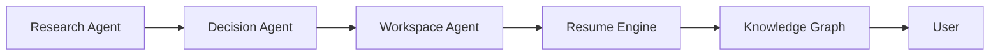

# §79 Agent Collaboration

◀ [[S78 AI Agent Framework]] · [[Part VII — Applications, Agents, Algorithms & Roadmap|▲ Part VII]] · [[S80 Context Engine Algorithms]] ▶

---

Agents communicate using structured outputs.

No agent should independently perform multiple unrelated responsibilities. Specialisation improves quality and simplifies evaluation.

All inter-agent communication conforms to `AgentMessage` (§56.2) and is subject to `[[REQ-AGT#PLX-AGT-010|PLX-AGT-010]]` through `[[REQ-AGT#PLX-AGT-015|PLX-AGT-015]]`.

---

---

## Requirements defined or cited here

- [[REQ-AGT#PLX-AGT-010|PLX-AGT-010]] — Inter-agent messages **MUST** conform to the `AgentMessage` schema and **MUST** be validated on both send and
- [[REQ-AGT#PLX-AGT-015|PLX-AGT-015]] — No Agent **MUST** hold more than one specialisation. An Agent performing unrelated responsibilities **MUST** b

◀ [[S78 AI Agent Framework]] · [[Part VII — Applications, Agents, Algorithms & Roadmap|▲ Part VII]] · [[S80 Context Engine Algorithms]] ▶
