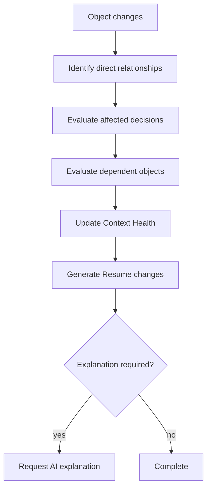

# §80 Context Engine Algorithms

◀ [[S79 Agent Collaboration]] · [[Part VII — Applications, Agents, Algorithms & Roadmap|▲ Part VII]] · [[S81 Resume Algorithms]] ▶

---

The Context Engine transforms raw Events into meaningful understanding.

### 80.1 Algorithm 1 — Materiality scoring

Every Event receives a materiality score.

**Inputs:** affected Objects · Decision impact · relationship depth · organisational reach · user role · workflow stage · historical significance.

**Output** determines whether the Event updates Context Health, triggers Resume regeneration, requests AI reasoning, or requires no action.

| ID | Requirement | V | Src |
|---|---|---|---|
| [[REQ-CTX#PLX-CTX-020|PLX-CTX-020]] | Materiality scoring **MUST** be a pure function of its declared inputs — deterministic, reproducible and free of model invocation (`[[REQ-CTX#PLX-CTX-010|PLX-CTX-010]]`, `[[REQ-CTX#PLX-CTX-011|PLX-CTX-011]]`). | T | §80 |
| [[REQ-CTX#PLX-CTX-021|PLX-CTX-021]] | The materiality function and its weights **MUST** be versioned, and the version **MUST** be recorded on every scoring Event, so that historical scores remain interpretable after the function changes. | T | §80, new |
| [[REQ-CTX#PLX-CTX-022|PLX-CTX-022]] | Materiality weights **MUST** be tunable per tenant without code deployment, and every tuning change **MUST** emit an auditable Event. | T, I | §80, new |

> **On `[[REQ-CTX#PLX-CTX-021|PLX-CTX-021]]`.** Without a recorded function version, a change to the materiality weights makes every historical Context Health decision uninterpretable — you cannot tell whether the system behaved differently last quarter because the data was different or because the scoring changed. That distinction is exactly what an auditor, or an engineer debugging a complaint, needs.

### 80.2 Algorithm 2 — Dependency propagation

Only affected branches of the graph are recalculated.

| ID | Requirement | V | Src |
|---|---|---|---|
| [[REQ-CTX#PLX-CTX-023|PLX-CTX-023]] | Propagation **MUST** be incremental. A change **MUST NOT** trigger recalculation of unaffected graph regions. | A, T | §80 |
| [[REQ-CTX#PLX-CTX-024|PLX-CTX-024]] | Propagation **MUST** be bounded by maximum depth and maximum fan-out, both tenant-configurable, and truncation **MUST** be recorded and visible (`[[REQ-CTX#PLX-CTX-013|PLX-CTX-013]]`). | T, A | §80, [[S51 Context Engine|§51]] |
| [[REQ-CTX#PLX-CTX-025|PLX-CTX-025]] | Synchronous propagation **MUST** be limited to the budget of `[[REQ-PERF#PLX-PERF-021|PLX-PERF-021]]`; propagation beyond that budget **MUST** continue asynchronously and **MUST** update Context Health on completion. | A, T | §80, [[S58 Performance Requirements|§58]] |
| [[REQ-CTX#PLX-CTX-026|PLX-CTX-026]] | Propagation **MUST** be cycle-safe. The Relationship graph is not acyclic and propagation **MUST** terminate on cyclic paths without repeated re-entry. | T | §80, new |

> **On `[[REQ-CTX#PLX-CTX-026|PLX-CTX-026]]`.** The relationship vocabulary includes `DependsOn`, `Blocks`, `Supports` and `References` with no acyclicity constraint, and real organisational dependencies genuinely are cyclic — Proposal depends on Pricing, Pricing references the Proposal's volume assumptions. Naive propagation over that graph does not terminate. This needs visited-set tracking on every traversal, and it needs to be a test, because it will be found in production otherwise, at the worst possible moment, on the largest customer.

### 80.3 Algorithm 3 — Context freshness

Every user maintains a contextual understanding score for every Desk. Factors: recent activity · review history · meaningful changes · decision relevance · outstanding risks. The score estimates how current the user's understanding is.

| ID | Requirement | V | Src |
|---|---|---|---|
| [[REQ-CTX#PLX-CTX-030|PLX-CTX-030]] | Context freshness **MUST** be computed per (user, Desk) and **MUST** decay with elapsed meaningful change, not with elapsed time alone. | T | §80 |
| [[REQ-CTX#PLX-CTX-031|PLX-CTX-031]] | Freshness scores **MUST NOT** be surfaced as a comparative measure between users, and **MUST NOT** be exportable in a form that supports individual performance ranking. | I, T | §80, new |

> **On `[[REQ-CTX#PLX-CTX-031|PLX-CTX-031]]`.** A per-user, per-Desk "how current is your understanding" score is one product decision away from being a leaderboard, and one tenant admin away from being used in a performance review. Once it is used that way, users will optimise for the score — opening Desks they do not need, marking things reviewed they have not read — and the signal that drives Context Health becomes noise. The metric is only useful while it is private and unweaponised.

---

---

## Requirements defined or cited here

- [[REQ-CTX#PLX-CTX-010|PLX-CTX-010]] — Materiality scoring **MUST** be deterministic and reproducible. Given identical inputs, it **MUST** produce an
- [[REQ-CTX#PLX-CTX-011|PLX-CTX-011]] — Materiality scoring **MUST NOT** require an AI model call in its primary path. AI **MAY** be used to enrich ex
- [[REQ-CTX#PLX-CTX-013|PLX-CTX-013]] — The Context Engine **MUST** bound dependency propagation by configured maximum depth and maximum fan-out. Wher
- [[REQ-CTX#PLX-CTX-020|PLX-CTX-020]] — Materiality scoring **MUST** be a pure function of its declared inputs — deterministic, reproducible and free
- [[REQ-CTX#PLX-CTX-021|PLX-CTX-021]] — The materiality function and its weights **MUST** be versioned, and the version **MUST** be recorded on every
- [[REQ-CTX#PLX-CTX-022|PLX-CTX-022]] — Materiality weights **MUST** be tunable per tenant without code deployment, and every tuning change **MUST** e
- [[REQ-CTX#PLX-CTX-023|PLX-CTX-023]] — Propagation **MUST** be incremental. A change **MUST NOT** trigger recalculation of unaffected graph regions.
- [[REQ-CTX#PLX-CTX-024|PLX-CTX-024]] — Propagation **MUST** be bounded by maximum depth and maximum fan-out, both tenant-configurable, and truncation
- [[REQ-CTX#PLX-CTX-025|PLX-CTX-025]] — Synchronous propagation **MUST** be limited to the budget of `PLX-PERF-021`; propagation beyond that budget **
- [[REQ-CTX#PLX-CTX-026|PLX-CTX-026]] — Propagation **MUST** be cycle-safe. The Relationship graph is not acyclic and propagation **MUST** terminate o
- [[REQ-CTX#PLX-CTX-030|PLX-CTX-030]] — Context freshness **MUST** be computed per (user, Desk) and **MUST** decay with elapsed meaningful change, not
- [[REQ-CTX#PLX-CTX-031|PLX-CTX-031]] — Freshness scores **MUST NOT** be surfaced as a comparative measure between users, and **MUST NOT** be exportab
- [[REQ-PERF#PLX-PERF-021|PLX-PERF-021]] — Context Health update — propagated impact (depth 2–N, within bound) — p50 120 ms, p95 350 ms, p99 **500 ms**.

◀ [[S79 Agent Collaboration]] · [[Part VII — Applications, Agents, Algorithms & Roadmap|▲ Part VII]] · [[S81 Resume Algorithms]] ▶
